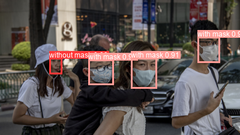
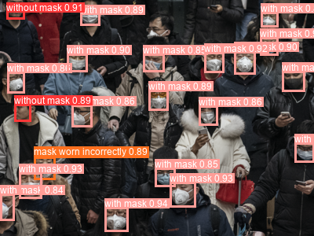

# Face Mask Detection Using YOLOv5

Tutorial: https://towardsdatascience.com/the-practical-guide-for-object-detection-with-yolov5-algorithm-74c04aac4843

Dataset: https://www.kaggle.com/datasets/andrewmvd/face-mask-detection

COVID-19 continues to spread widely even though the world has battled with it for close to 3 years. In most countries, wearing of face masks is encouraged, if not mandated. However, some individuals may decide to flout the rules by not wearing masks, or wearing them incorrectly. This can pose a problem to authorities who wish to curb the spread of the virus. This project serves to provide a fast and reliable way to detect whether individuals are wearing face masks.

Refer to [this notebook](Face%20Mask%20Detection.ipynb) for instructions to train a face mask detector and to use a pretrained model to make predictions.

Sample outputs:

